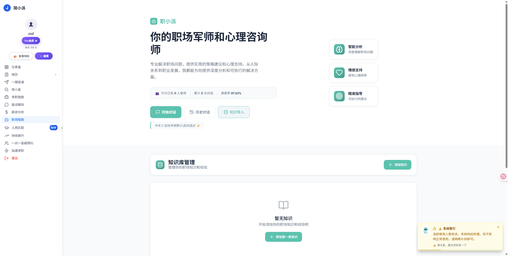

# 🚀 简小派新版本文档

欢迎来到 **简小派（JianXiaoPai）新版本文档中心**！

新版简小派进行了 **全面升级与重构**，无论是产品形态、智能引擎还是用户体验，都实现了质的提升。  
我们将求职全流程与智能化辅助深度融合，为用户打造一站式职业成长平台。
---

## 🌐 官方网站

🔗 [官网：https://jianlipai.com](https://jianlipai.com)

🔗 [论坛 (重构中) ：https://luntan.jianlipai.com](https://luntan.jianlipai.com)

🔗 [文档 ：https://docs.jianlipai.com](https://docs.jianlipai.com)

## ✨ 核心功能

| 功能名称 | 简介 |
|-----------|------|
| 🚀 **一站式求职** | 覆盖求职准备、投递执行与面试辅导的全流程解决方案。 |
| 🛡️ **简小鉴** | 企业风险智能识别，职位画像一目了然，提升决策效率。 |
| 🤝 **求职陪跑** | AI 导师陪伴，结合数据反馈调整策略，稳步推进每一步。 |
| 🎤 **面试模拟** | 多场景模拟 AI 面试演练，实时给出结构化改进建议。 |
| 📊 **薪资分析** | 聚合行业数据，提供谈薪参考与预期管理。 |
| 🏃‍♂️ **职场陪跑** | 入职后持续跟进，规划成长路径，快速适应新环境。 |
| 🎯 **人岗匹配** | 依据能力画像与岗位需求双向匹配，精准推荐高契合机会。 |
| 💬 **一对一答疑** | 专家团队实时解答求职疑问，提供个性化建议。 |
| ⚡ **加速求职** | 自动化工具与资源整合，让每一次投递都更快抵达目标。 |

---

## 🖼️ 产品预览

  
  
  
  
  

## 📅 文档进度

- 🔄 功能模块逐步补充中  

## 💬 反馈与建议

我们欢迎一切关于文档与产品的反馈。  
如果你在使用过程中有任何问题或建议，欢迎通过以下渠道联系我们：

- 📧 邮箱：support@jianxiaopai.com  
- 💬 社区论坛（重构中，即将开放）  
- 💬 QQ群：1043216521  

感谢你关注 **简小派新版本**！  
我们正在努力打造一个更智能、更高效的求职与职业成长平台 🌟
