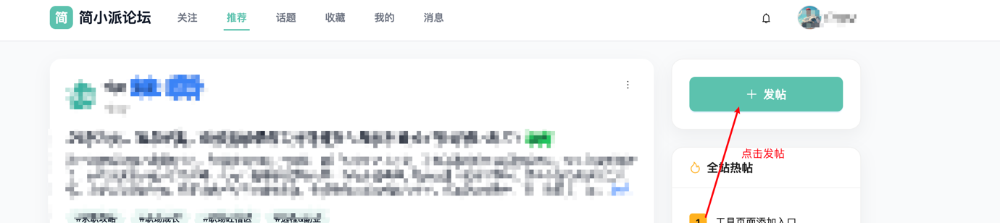
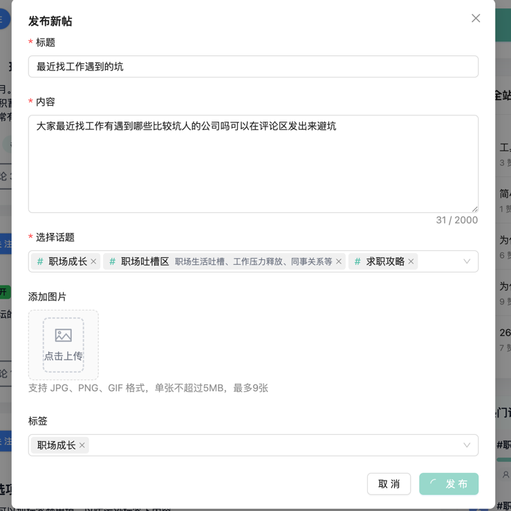
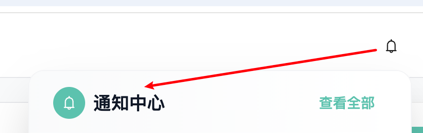

# 如何发帖
1. **登录简小派平台--访问主页--点击发帖**

2. **输入要发布的帖子标题、内容(可选择相关话题以及标签),可自行选择添加上传图片--最后点击发布即可(注意:发布内容的合规性最后由AI来进行严格审核)--最后点击发布即可**

3. **发布成功后,可在个人主页查看已发布的帖子**

4. **在个人主页中,可以看到自己发布的帖子，以及评论过的内容以及收藏的帖子**

5. **在消息通知中心可以看到帖子被赞以及关注的内容**

6. **在关注页面可以看到自己关注的账号发的帖子内容**
