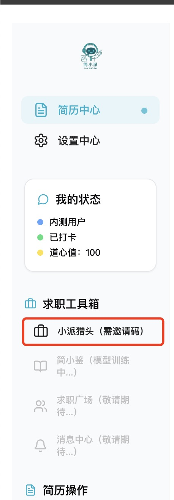
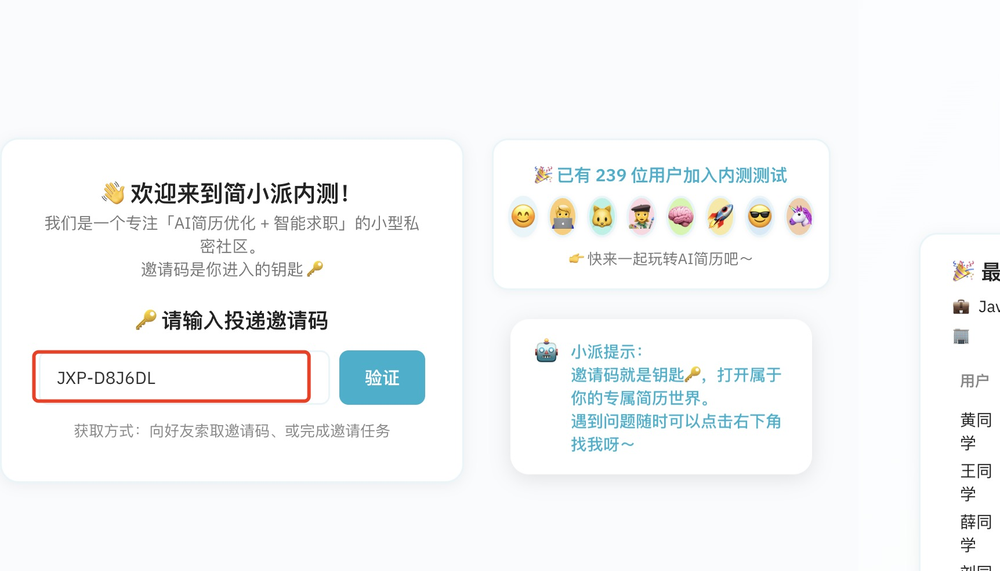
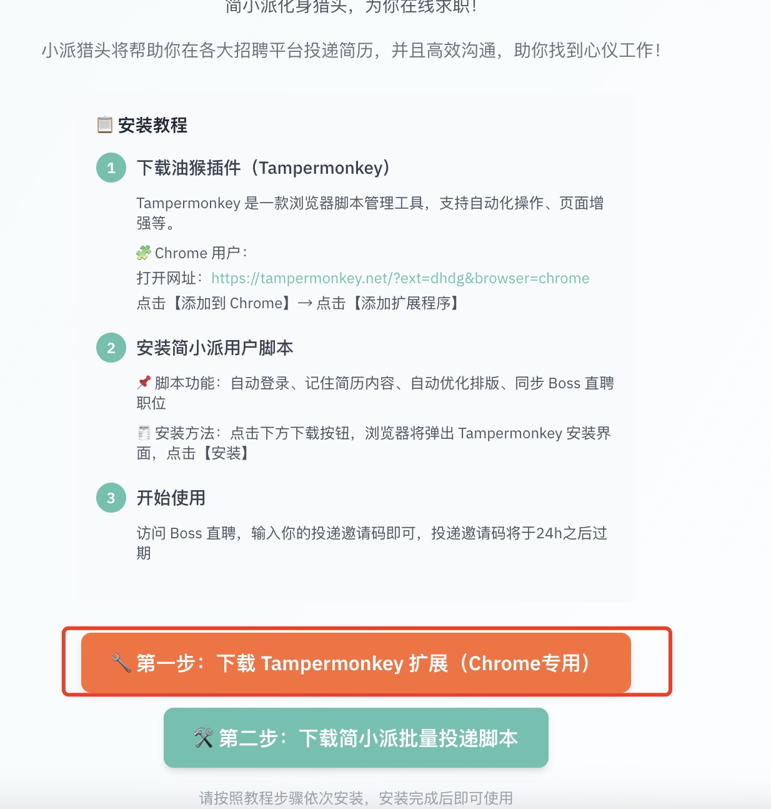
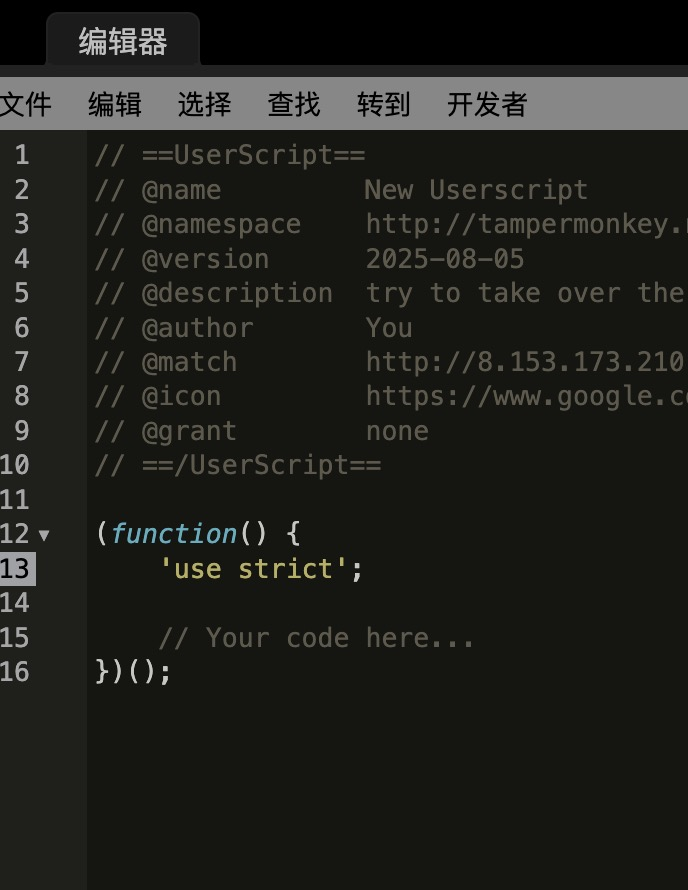
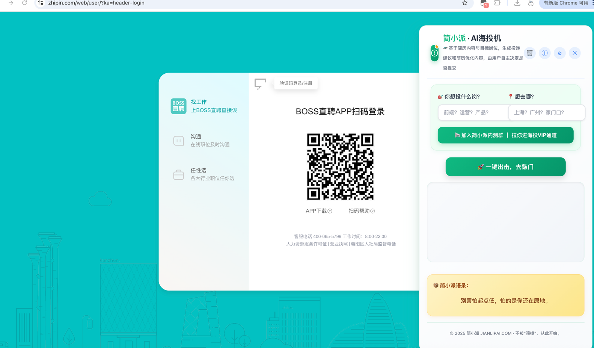
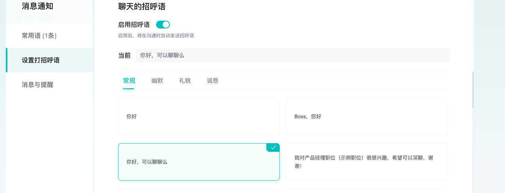
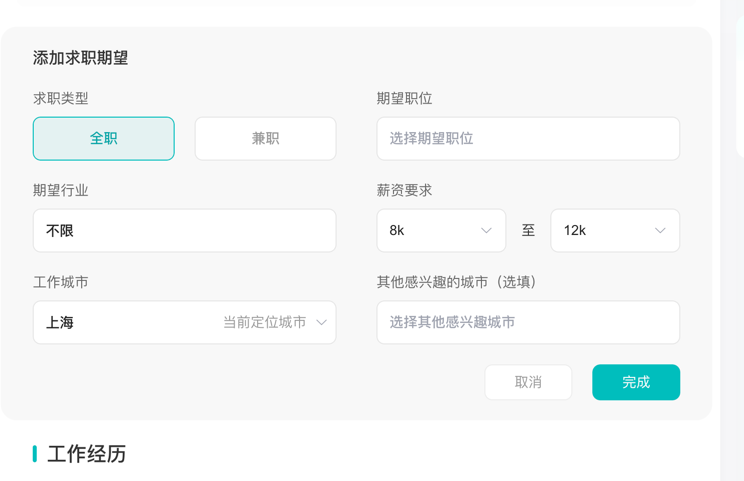
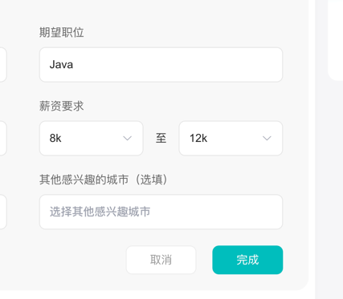
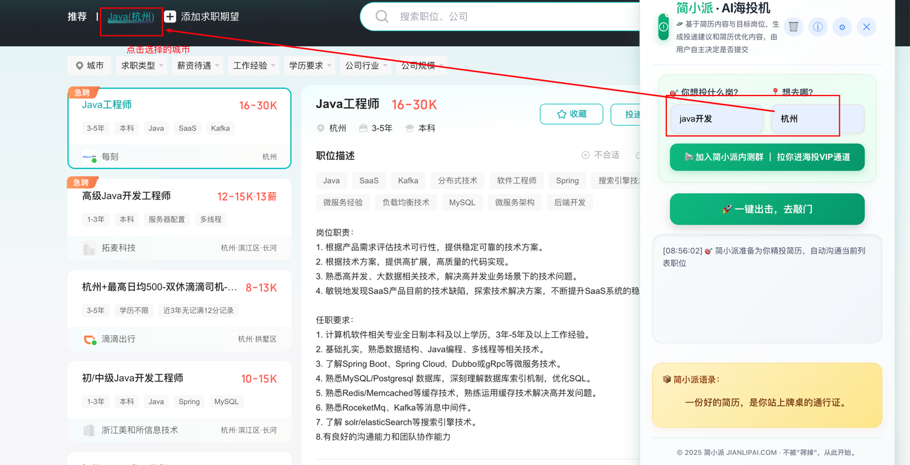

# 如何使用简小派猎头功能

简小派的猎头功能是AI智能投递系统，它模拟真实猎头的工作方式，帮你精准投递简历，提高求职成功率。

## 🤖 什么是猎头功能？

猎头功能是简小派的核心功能之一，它能够：

- **智能匹配岗位**：根据你的简历自动匹配合适的岗位
- **自动投递简历**：模拟真实猎头操作，自动投递到Boss直聘
- **实时跟踪状态**：监控投递进度和面试邀请
- **数据分析优化**：提供投递效果分析和优化建议

## 🚀 使用步骤

### 第一步：授权Boss直聘

1. **登录简小派平台**
   - 访问 [简小派内测平台](https://jianlipai.com/)
   - 使用账号密码登录

2. **进入猎头功能**
   - 在平台首页找到"小派猎头（需邀请码）“
   
   - 点击进入功能页面

3. **输入投递邀请码**
   - 在群里抢到投递邀请码或者L4每日自动生成
   - 输入
   注意事项：邀请码必须在一个小时后之内使用（下载脚本），并且使用，否则会失效，邀请码有效期1天，投递上线100次
   

4. **下载油猴插件和猎头插件**
    

5. **油猴添加新脚本**
    

6. **复制并保存启用**
    

7. **打开boss直聘即可使用**

8. **使用之前在boss直聘中启用招呼语否则筛选完成会卡死在聊天页面**

9. **打开boss直聘--点击职位--点+--添加求职期望--**

10. **期望职位选择后端开发-- java--点击完成**

11. **返回职位--点击选择的期望城市--用脚本直接点击一键出击就可自动筛选岗位并且AI进行智能聊天**

12. **等待筛选自动完成发送附件简历即可完成**

注意：只能在网页端使用，用输入码的那一台设备使用

1. **AI分析岗位**
   - 系统自动分析Boss直聘上的岗位
   - 根据你的简历和偏好进行匹配
   - 筛选出高匹配度的岗位

2. **自动投递简历**
   - AI模拟真实猎头操作
   - 自动填写投递信息
   - 发送个性化的求职信

3. **实时跟踪状态**
   - 查看投递进度
   - 监控简历查看状态
   - 跟踪面试邀请

## 🎯 功能优势

### 1. 智能匹配算法
- **技能匹配**：分析你的技能与岗位要求的匹配度
- **经验匹配**：根据你的工作经验推荐合适岗位
- **薪资匹配**：确保岗位薪资符合你的期望

### 2. 个性化投递
- **定制求职信**：根据岗位特点生成个性化求职信
- **简历优化**：针对不同岗位调整简历重点
- **投递时机**：选择最佳投递时间，提高被查看率

### 3. 数据驱动决策
- **投递分析**：统计投递效果，优化投递策略
- **岗位趋势**：分析市场热门岗位和薪资趋势
- **成功率预测**：基于历史数据预测面试成功率

## 📊 使用效果对比

### 传统投递 vs 猎头功能

| 对比项目 | 传统投递 | 简小派猎头功能 |
|---------|---------|---------------|
| 投递效率 | 手动搜索，耗时耗力 | AI智能匹配，一键投递 |
| 回复率 | 5%左右 | 25%+ |
| 岗位匹配 | 盲目投递 | 精准匹配 |
| 跟踪管理 | 无法跟踪 | 实时状态跟踪 |
| 数据分析 | 无 | 详细效果分析 |

## 💡 使用技巧

### 1. 简历准备
- 确保简历信息完整准确
- 使用关键词优化简历内容
- 准备多份针对不同岗位的简历

## ⚠️ 注意事项

### 1. 授权安全
- 简小派严格遵守数据安全规范
- 不会泄露你的个人信息
- 授权可以随时取消

### 2. 平台规则
- 遵守Boss直聘的使用规则
- 避免过度投递，防止账号被限制
- 保持简历内容的真实性

### 3. 合理期望
- 猎头功能可以提高投递效率，但不能保证100%成功
- 面试成功还需要个人能力和面试表现
- 建议结合其他求职方式

## 🔧 常见问题

### Q: 可以同时投递多个岗位吗？
A: 可以，系统会根据你的简历匹配多个相关岗位，提高投递效率。

### Q: 如何知道投递效果？
A: 系统会实时跟踪投递状态，包括简历查看、面试邀请等，并提供详细的数据分析。

### Q: 投递失败怎么办？
A: 系统会自动重试，如果持续失败，会暂停投递并通知你检查授权状态。

### Q: 如何优化投递效果？
A: 定期更新简历内容，根据投递反馈调整策略，保持简历与目标岗位的匹配度。

## 🤝 社区支持

该文档由简小派社区 **lrisru** 改写

**加入社区QQ群：1043216521**

**让简小派社区变得更好，造福更多人**

---

